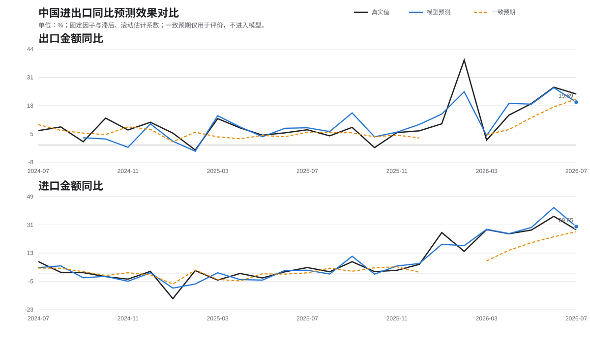

# 中国进出口预测模型研究（固定因子滚动估计版）

## 定版口径

进出口模型统一采用“固定因子结构＋扩展窗口滚动估计系数＋春节日历门控”。因子家族和滞后期不再逐月变化；目标月的回归均值、标准差和系数只使用目标月以前的真实值估计。一致预期只参与模型评价，绝不进入特征筛选、训练或预测。

任一固定月频因子没有公布时，该月状态记为`WAITING_FOR_FIXED_FACTORS`，不发布模型预测，不用同类指标替换，也不向更早滞后期回退。

## 固定因子

### 出口同比

| 固定因子 | iFinD ID | 固定对齐 | 用途 |
|---|---|---:|---|
| 韩国自中国进口金额同比 | `G022252836` | 目标月当月值（lag0） | 及时反映中国对韩出口 |
| 中国台湾自大陆进口金额 | `G002610107` | 上月值计算同比（lag1） | 东亚电子与中间品需求 |
| 泰国自中国进口金额 | `G019713134` | 上月值计算同比（lag1） | 东盟目的地需求 |

1—3月额外启用三个确定性春节日历变量：节前14天抢出口工作日同比、春节起14天停工工作日同比、节后14—27天复工工作日同比。其他月份日历门控为零。

### 进口同比

| 固定因子 | iFinD ID | 固定对齐 | 用途 |
|---|---|---:|---|
| 韩国出口金额同比的当月变化 | `G012203163` | 目标月当月值变化（lag0） | 全球电子周期和亚洲供应链景气 |

进口模型以上一期已公布的中国进口同比为锚，预测当月相对上月的变化；1—3月加入同一组春节日历变量。动态相关性筛选版本完整保留为历史比较列，但不再作为正式预测。

## 最早可预测时间

目标月记为`T`。固定因子全部齐备后才生成预测：

| 目标 | 最晚约束因子 | 理论最早生成时间 | 实务口径 |
|---|---|---|---|
| 出口同比 | 韩国`T`月自中国进口；同时要求台湾、泰国`T-1`月数据已入库 | `T+1`月1日 | 韩国完整月度贸易通常次月1日发布；待iFinD入库并通过ID、名称、频率、单位校验后生成，通常按1—2日观察 |
| 进口同比 | 韩国`T`月出口；同时要求中国`T-1`月进口同比已公布 | `T+1`月1日 | 若上一期中国进口真实值尚未发布，则继续等待，不用旧锚替代 |

这意味着模型不再是月内实时nowcast，而是“次月初、海关中国数据公布前的月度预测”。1—2月若中国海关发布节奏导致进口模型缺少上期实际值，进口预测会顺延到该值正式发布以后；出口模型没有上一期中国出口真实值锚，因此不受此项限制。

以当前目标月`2026-08`为例：

| 目标 | 当前缺失固定因子 | 理论最早预测日 |
|---|---|---:|
| 出口同比 | 韩国2026-08自中国进口、泰国2026-07自中国进口 | 2026-09-01；若iFinD或泰国数据未入库则顺延 |
| 进口同比 | 韩国2026-08出口同比 | 2026-09-01；实际按iFinD入库时间顺延 |

因此当前两个正式预测值均为空。此前动态模型给出的出口20.5710%、进口27.6523%仅保留在`legacy_dynamic_model_forecast`用于版本追踪，不作为固定版结果。

## 滚动回测结果

固定模型可计算的共同样本内，三条序列使用完全相同月份比较：

| 目标与模型 | 样本 | RMSE | MAE | 方向命中率 |
|---|---:|---:|---:|---:|
| 出口固定因子＋春节门控 | 21 | **3.8721** | **2.7968** | 90.48% |
| 出口旧动态因子＋春节门控 | 21 | 3.8432 | 2.8956 | 85.71% |
| 出口一致预期 | 21 | 4.8833 | 4.0863 | 90.48% |
| 进口固定因子＋春节门控 | 23 | **3.4213** | **2.6477** | 78.26% |
| 进口旧动态因子＋春节门控 | 23 | 3.4213 | 2.6477 | 78.26% |
| 进口一致预期 | 23 | 6.6087 | 4.6884 | 86.96% |

出口固定版RMSE比旧动态版高0.0289个百分点，但MAE下降0.0988个百分点、方向命中率提高4.77个百分点，且结构稳定、可解释、不会逐月换因子。进口固定版与旧动态版完全相同，因为旧动态规则在可用月份实际一直选中韩国出口因子。

## 时间序列图

## 验收状态

- 固定因子与固定滞后：通过。
- 系数仅用目标月之前样本滚动估计：通过。
- 缺因子时停止预测、禁止替换与滞后回退：通过。
- 春节日历门控保留：通过。
- 一致预期仅用于评价：通过。
- iFinD模糊召回后精确字段校验：通过。
- 网页发布：未执行，等待因子口径确认及最新月固定因子齐备。

完整结果见`outputs/trade-model-research/model-race.csv`和`model-race.json`。
